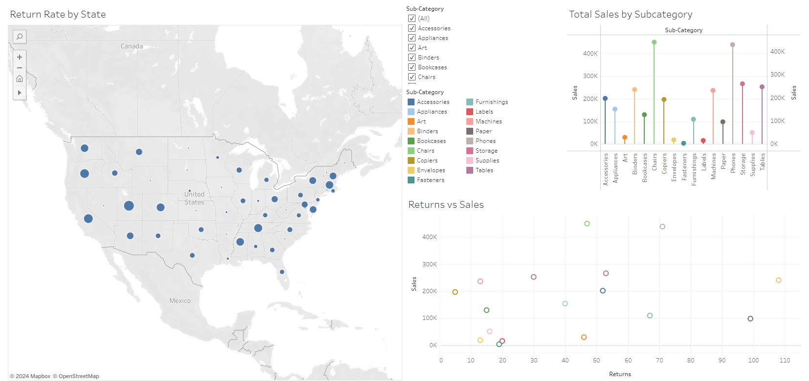
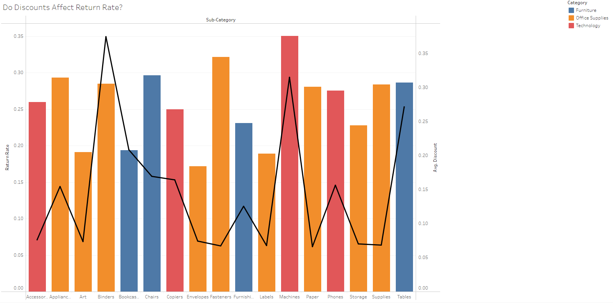
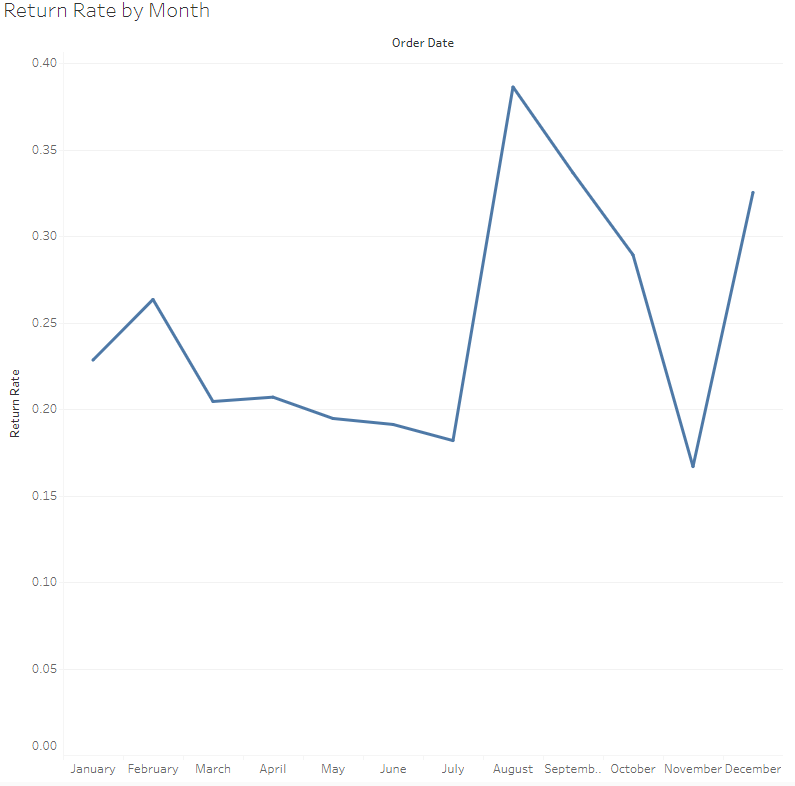

README.md

# Tripleten Sprint 5 Project Superstore, Tableau

This is the 5th 4th project with Tripleten and it uses a combination of everything thus far to create several workbooks and a coherent dasboard presentation

### The Data

The data used was Tableaus Superstore dataset, this is spread across 3 tables:

- `Orders`
    - `'Category'` The category of item purchased
    - `'City'` The city the product was ordered in
    - `'Country/Region'` The country and region the product was ordered in
    - `'Customer ID'` The ID number of the customer
    - `'Customer_Name'` The name of the customer
    - `'Order_Date'` The date the product was purchased
    - `'Order ID'` The ID of the specific order
    - `'Product ID'` The ID of the specific product
    - `'Product_Name'` The name of the product
    - `'Region'` The region the order was placed in
    - `'Segment'` The type of product purchased
    - `'Ship_Date'` The date the product was shipped on
    - `'Ship Mode'` The type of shipping asked for by the customer
    - `'State'` The state the product was shipped to
    - `'Sub-category'` Narrowed down category of the item
    - `'Discount'` The discount applied to the purchase
    - `'Postal Code'` The postal code the item was sent to
    - `'Profit'` The profit Superstore made from the purchase
    - `'Quantity'` How many were purchased
    - `'Row ID'` Where the product is located in the table
    - `'Sales'` Total sales for the product

- `People`
    - `'Region'` The region the person is located
    - `'Regional Manager'` The regional Managers name

- `Returns` 
    - `'Order ID'` ID of the order
    - `'Returned'` If the item was returned or not

### The Process

I first explored the dataset and left joined the returns table onto the orders table so that I could more 
easily sort through the data. I then took the questions asked for hte project and created worksheets to 
answer them effectively. Which I then turned those worksheets into a Dashboard and created a presentation.

### Results

The results are explained in greater detail through the presentation document and slideshow. But it was shown that there were slight correlations between returns and the season, along with trends in returns when there are higher discounts applied.

The full Tableau worksheet can be found here:
https://public.tableau.com/app/profile/louis.zydor/viz/Storytelling_Project_Final/Sheet1#1